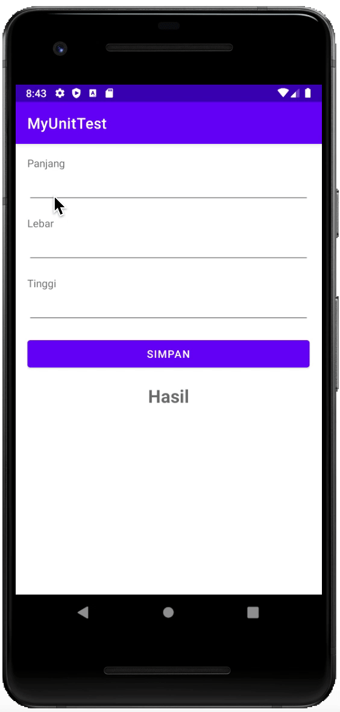

# Penerapan MVVM dan Testing

Library yang digunakan untuk testing: :books:
- [x] Mockito baca [disini](https://site.mockito.org/)
- [x] Expresso baca [disini](https://developer.android.com/training/testing/espresso)

## MVVM
...

## Unit Test
...

## Test Instrumental
...

## Screenshoot App

## Thanks to
- [x] Allah
- [x] [Sense Martin](https://github.com/martinputra) 🤗
- [x] Sumber referensi 

